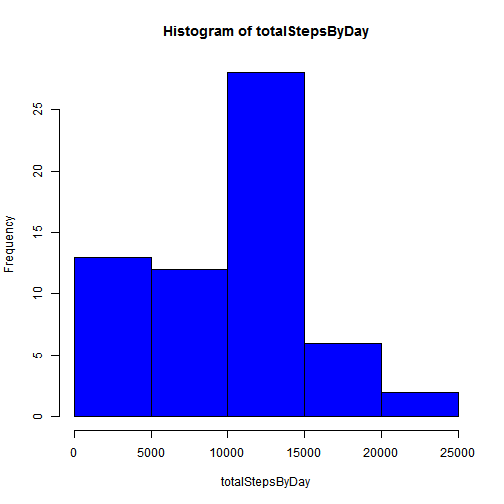
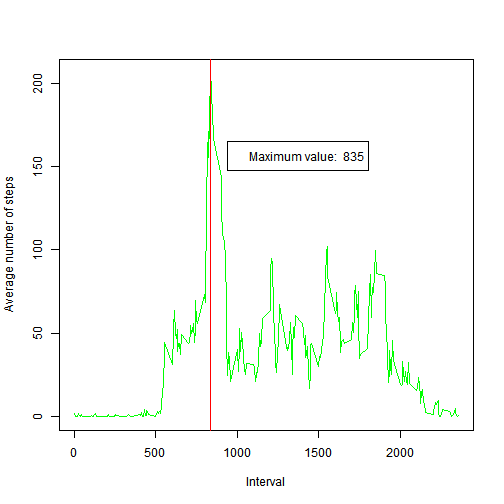
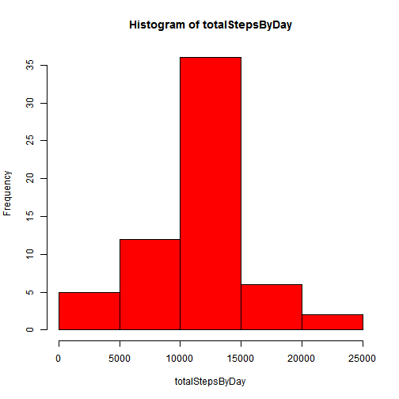
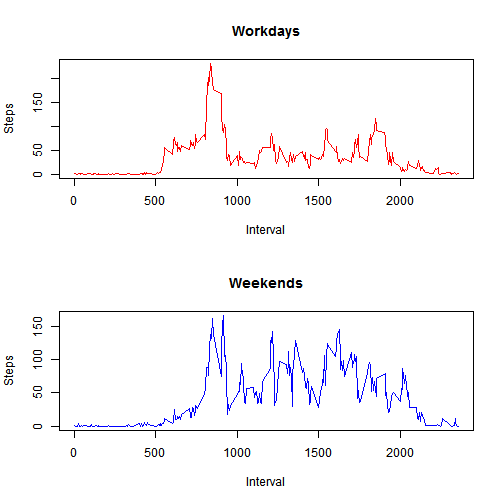

###Assignment

This assignment will be described in multiple parts. You will need to write a report that answers the questions detailed below. Ultimately, you will need to complete the entire assignment in a single R markdown document that can be processed by knitr and be transformed into an HTML file.

Throughout your report make sure you always include the code that you used to generate the output you present. When writing code chunks in the R markdown document, always use echo = TRUE so that someone else will be able to read the code. This assignment will be evaluated via peer assessment so it is essential that your peer evaluators be able to review the code for your analysis.

For the plotting aspects of this assignment, feel free to use any plotting system in R (i.e., base, lattice, ggplot2)

Fork/clone the GitHub repository created for this assignment. You will submit this assignment by pushing your completed files into your forked repository on GitHub. The assignment submission will consist of the URL to your GitHub repository and the SHA-1 commit ID for your repository state.

NOTE: The GitHub repository also contains the dataset for the assignment so you do not have to download the data separately.


### Loading and preprocessing the data

```r
activityData <- read.csv("activity.csv")
```
Process/transform the data (if necessary) into a format suitable for your analysis

```r
filteredData <- activityData[!is.na(activityData$steps),]
```

### What is mean total number of steps taken per day?

For this part of the assignment, you can ignore the missing values in the dataset.

- Make a histogram of the total number of steps taken each day

```r
totalStepsByDay <- tapply(activityData$steps, activityData$date, sum, simplify = T, na.rm=T)
hist(totalStepsByDay, col="blue")
```

 


- Calculate and report the mean and median total number of steps taken per day

```r
meanStepsByDay <- tapply(activityData$steps, activityData$date, mean, simplify = T)
medianStepsByDay <- tapply(activityData$steps, activityData$date, median, simplify = T,na.rm=T)
```
### What is the average daily activity pattern?
- Make a time series plot (i.e. type = "l") of the 5-minute interval (x-axis) and the average number of steps taken, averaged across all days (y-axis)


```r
y <- tapply(activityData$steps, activityData$interval, mean, simplify = T, na.rm=T)
x <- unique(activityData$interval) # automatically ordered
plot(x, y, type = "l", xlab ="Interval", ylab="Average number of steps", col="green")

optimum <- order(y,decreasing=T)[1]
abline(v=unique(activityData$interval)[optimum], col="red")
legendText = paste("Maximum value: ", as.character(unique(activityData$interval)[optimum]) )
legend( legend = legendText ,max(y)*.8,x=max(x)*0.4 )
```

 

- Which 5-minute interval, on average across all the days in the dataset, contains the maximum number of steps?

*As we can see above, the maximum value is attained at interval* ***835***


### Imputing missing values
Note that there are a number of days/intervals where there are missing values (coded as NA). 
The presence of missing days may introduce bias into some calculations or summaries of the data.

- Calculate and report the total number of missing values in the dataset (i.e. the total number of rows with NAs)

```r
logicalVectorMissingValues <- is.na(activityData$steps) | is.na(activityData$steps) | is.na(activityData$interval)
numberOfMissingValues <- sum(logicalVectorMissingValues)
```

Devise a strategy for filling in all of the missing values in the dataset. The strategy does not need 
to be sophisticated. For example, you could use the mean/median for that day, or the mean for that 5-minute
interval, etc.

*NA values will be replaced with interval means*

- Create a new dataset that is equal to the original dataset but with the missing data filled in.


```r
intervalMeans <- tapply(activityData$steps, activityData$interval, mean, simplify = T, na.rm=T)
for (var in 1:nrow(activityData)) {
  if ( is.na(activityData[var,]$steps) ){
    newValue <- intervalMeans[as.character(activityData[var,]$interval)] # Interval mean throughout the time period
    activityData[var,]$steps <- newValue
  }  
}
```

- Make a histogram of the total number of steps taken each day 


```r
totalStepsByDay <- tapply(activityData$steps, activityData$date, sum, simplify = T, na.rm=T)
hist(totalStepsByDay, col="red")
```

 

- and Calculate and report the mean and median total number of steps taken per day. 


```r
meanStepsByDay <- tapply(activityData$steps, activityData$date, mean, simplify = T)
medianStepsByDay <- tapply(activityData$steps, activityData$date, median, simplify = T,na.rm=T)
```
- Do these values differ from the estimates from the first part of the assignment? 

*They do,* ***significantly*** *.*

- What is the impact of imputing missing data on the estimates of the total daily 
number of steps?

*It greatly increases the total steps by day*


### Are there differences in activity patterns between weekdays and weekends?

For this part the weekdays() function may be of some help here. Use the dataset with the filled-in missing values for this part.

- Create a new factor variable in the dataset with two levels - "weekday" and "weekend" indicating whether a given date is a weekday or weekend day.


```r
activityData$dayType <- "weekday"
weekendDays <- weekdays(c(as.Date("1980-01-05"), as.Date("1980-01-06")),abbreviate=T) #Saturday and sunday
activityData[weekdays(as.Date(activityData$date), abbreviate=T) %in% weekendDays,]$dayType <- "weekend" 
```

- Make a panel plot containing a time series plot (i.e. type = "l") of the 5-minute interval (x-axis) 
and the average number of steps taken, averaged across all weekday days or weekend days (y-axis).
*See the README file in the GitHub repository to see an example of what this plot should look like
using simulated data.*

```r
par( mfrow = c( 2, 1 ) )
workdays <- activityData[activityData$dayType == "weekday",]
weekends <- activityData[activityData$dayType == "weekend",]
y1 <- tapply(workdays$steps, workdays$interval, mean, simplify = T, na.rm=T)
y2 <- tapply(weekends$steps, weekends$interval, mean, simplify = T, na.rm=T)
x1 <- unique(workdays$interval) # automatically ordered
x2 <- unique(weekends$interval) # automatically ordered
plot(x1, y1, type = "l", xlab ="Interval", ylab="Steps",col="red")
title(main = "Workdays")
plot(x2, y2, type = "l", xlab ="Interval", ylab="Steps",col="blue")
title(main = "Weekends")
```

 

***There are great differences, the number of steps taken on the [1000-2000] interval 
are greater on weekends. Likewise, the number of steps taken on the [500-800] interval
greater than the same interval on weekdays (workdays)***k
